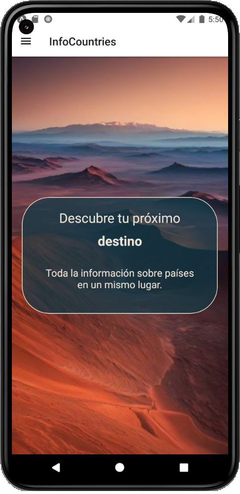
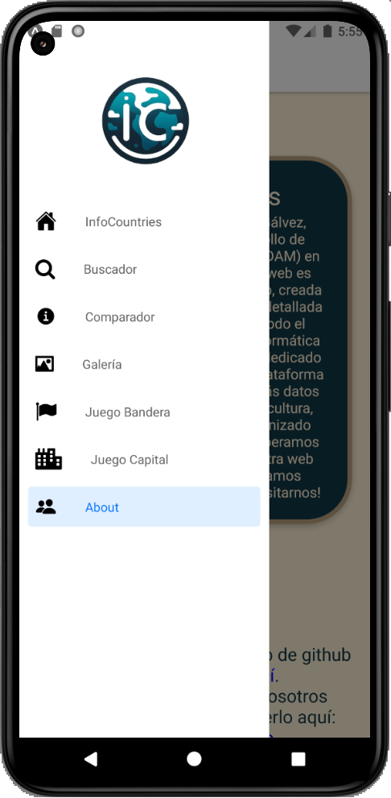
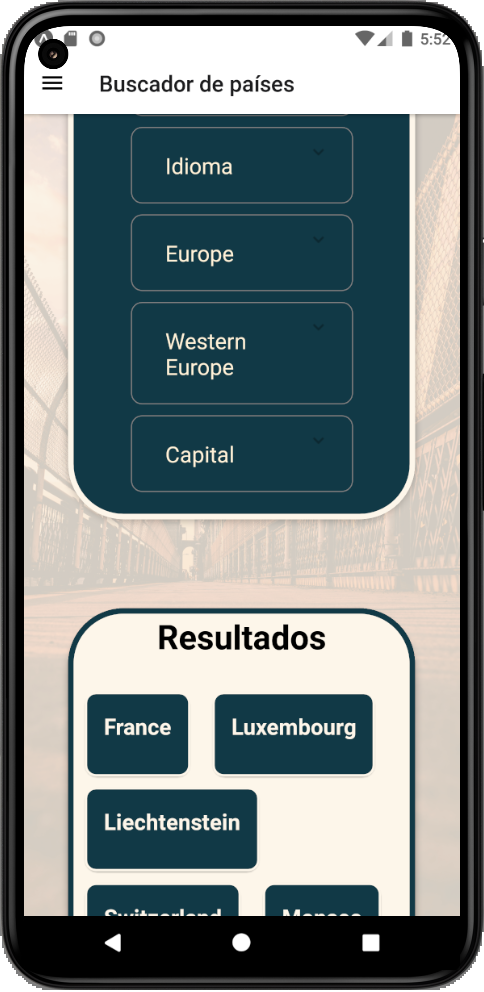
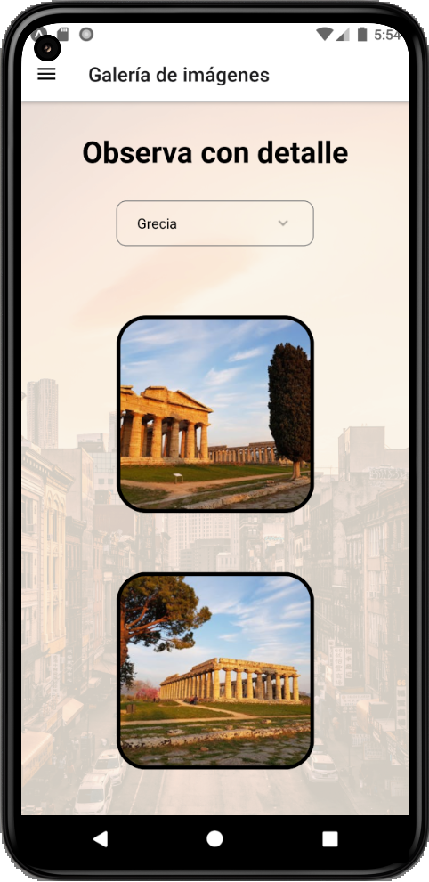
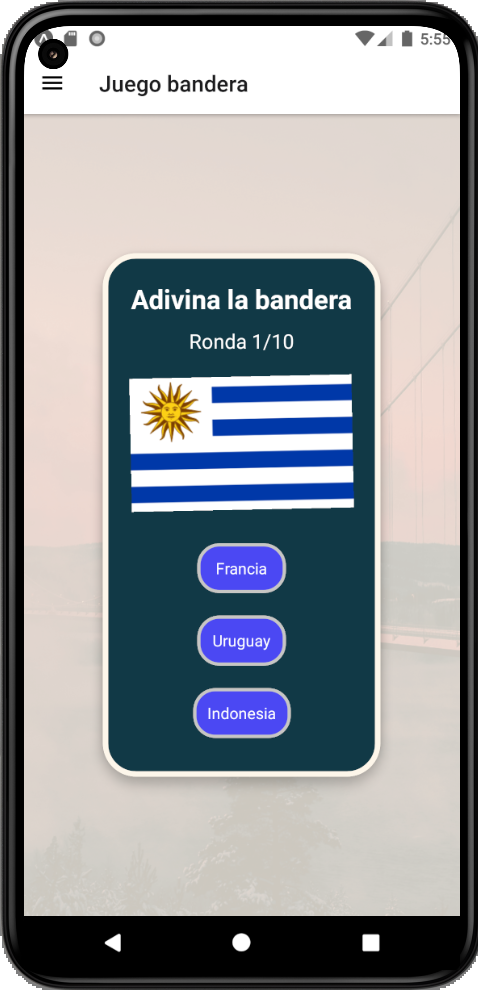

Esto es el parte del proyecto de fin de grado del curso DAM en el IES Ginés Pérez Chirinos, en 2024, realizado por Juan Valera y Víctor Gálvez.

Puedes descargar la APK para probar la aplicación aquí: https://drive.google.com/file/d/1OGtnDefgUDu34SXUPTxjuD-7CkYS3k_Y/view?usp=sharing

Puedes encontrar la versión para web con React aquí: https://github.com/JuanValeraDev/InfoCountries

Algunas capturas de la aplicación:

